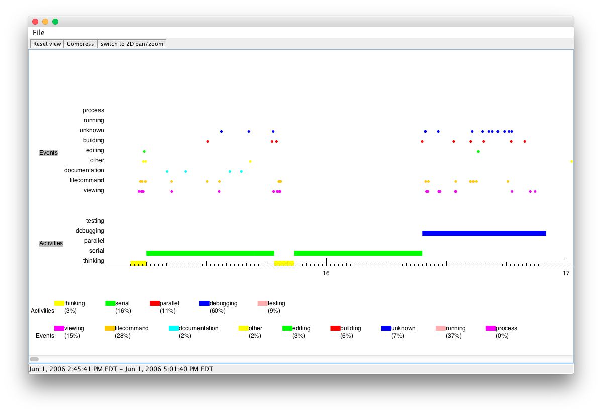

# ActivityGraph

ActivityGraph is an interactive application for visualizing developer workflow.

The purpose of ActivityGraph is to provide support for developing and evaluating
workflow heuristics to determine where programmers spend their time.

It should allow you to visualize the developer activities at different levels of
abstraction, from low-level captured events, to higher-level events that have
either been inferred from lower-level ones or observed in some other way. It's
general enough that it could be used to analyze any type of temporal,
categorical data.

Ultimately, it should allow you to compare the output of heuristics with some
"true" output, to identify how accurate the heuristics are, as well as
identifying where errors are occurring.

.

## Interacting with ActivityGraph

Use the left mouse button (while moving the mouse) to pan.

Use the right mouse button (while moving the mouse) to zoom.

Double-click on a series in a group to collapse all of the series elements to the same y-value.


## Building ActivityGraph

ActivityGraph can be built and run using the included ant script (build.xml).
You'll need Ant version 1.7.0 or higher to run the (JUnit 4.x) unit tests, but earlier
versions of ants should be able to successfully compile and run ActivityGraph.

To build ActivityGraph, type:

    $ ant compile

To run the unit tests, type:

    $ ant test

To run ActivityGraph, type:

    $ ant run

Try opening the XML file data/demo.xml to try out the visualization (using the
File menu). See [format.md](format.md) for information on the file format.


## Data sources

ActivityGraph supports an XML format, as well as several other sources that are
pretty obsolete now (subversion repository, Trac repository).


## Packaging ActivityGraph (obsolete)

If you wish to create a package of ActivityGraph for deployment, first make sure
you have a ~/work directory (where a pristine version of ActivityGraph will be
checked out) and a ~/testinstall directory (which will contain the deployed
files).

Also make sure your local subversion sandbox is up to date before generating a
package.

To generate a package, type:

```
$ cd bin
$ sh release_generate.sh
```

This will do the following:

* Check out the latest version of ActivityGraph to ~/work/ActivityGraph
* Run the unit tests on the newly checked out version
* Create a zipfile in ~/work/ActivityGraph/dist
* Unzip this file into ~/testinstall/ActivityGraph-rxx where xx is the revision number returned by the svnversion command


